# COLLEGE MANAGEMENT SYSTEM

The College Management System Project in Java is a comprehensive Java project that facilitates the management of colleges and universities. It includes features such as adding new students and teachers, tracking their enrollment and leaving details, managing student marks, fee structures, and utilities such as notepad,calculator, and web browser. The system also has an update feature to modify the details of students and teachers.This application provides a user-friendly interface that makes it easy for college staff to manage all college operations in one place, saving time and effort. It can help streamline administrative tasks and increase efficiency in managing college operations.

# Here are some of the key features of college management system:

## Student Management

## Teacher Management

## Fees Management

## Exam Management

## How it works

This project aims to provide a centralized and efficient platform for managing various operations in a college.

To access this college management system, users are required to login with their username and password.

Once logged in, users can access the main interface of the application which allows them to manage all college operations

## Images

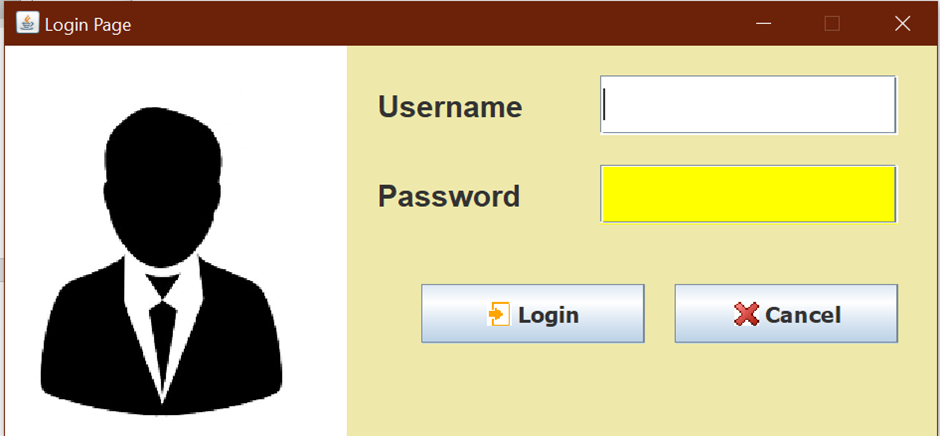

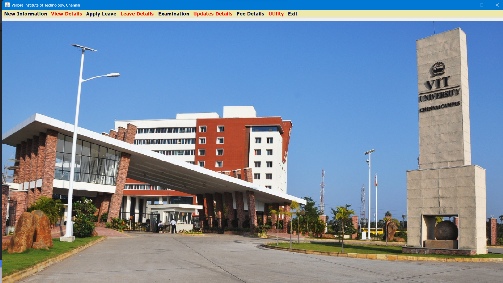

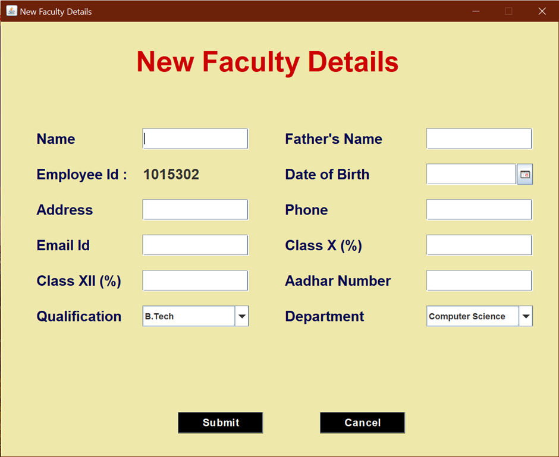

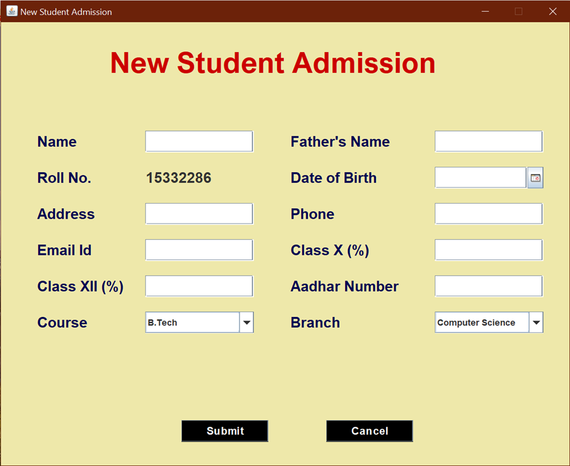

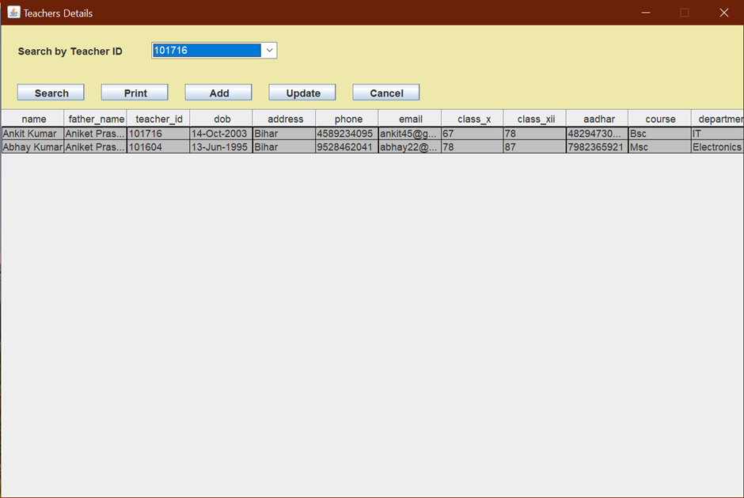

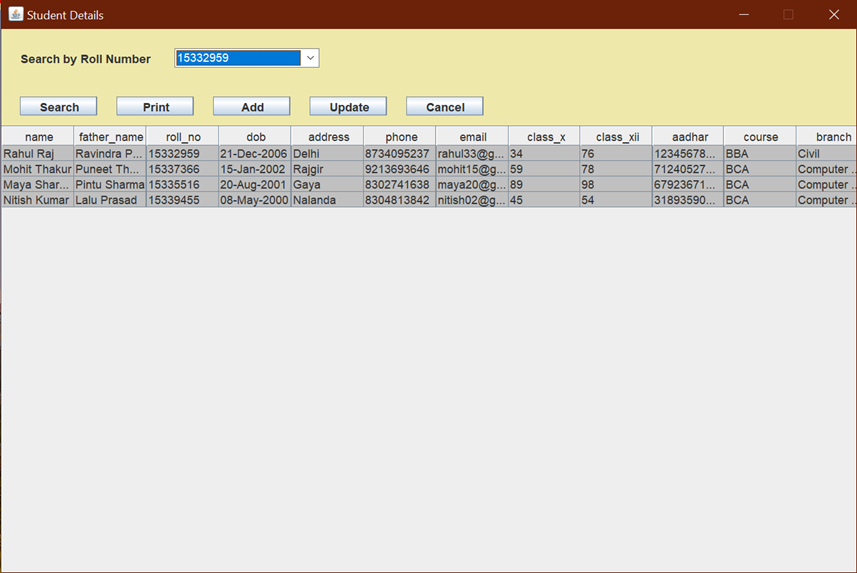

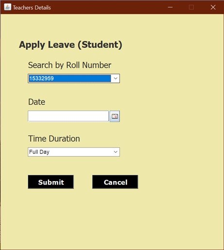

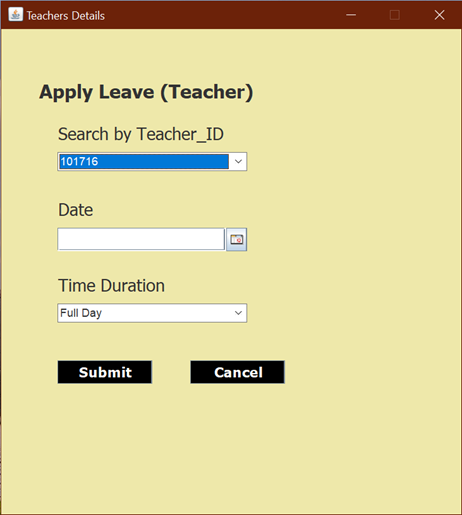

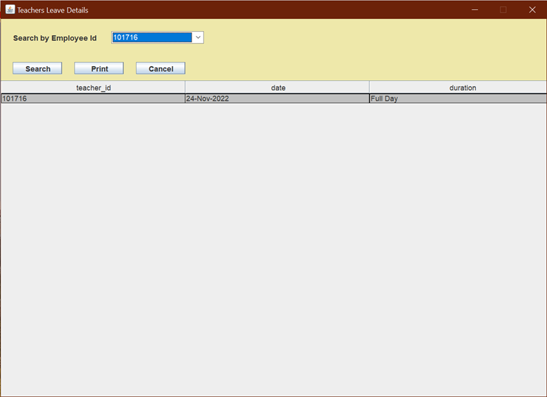

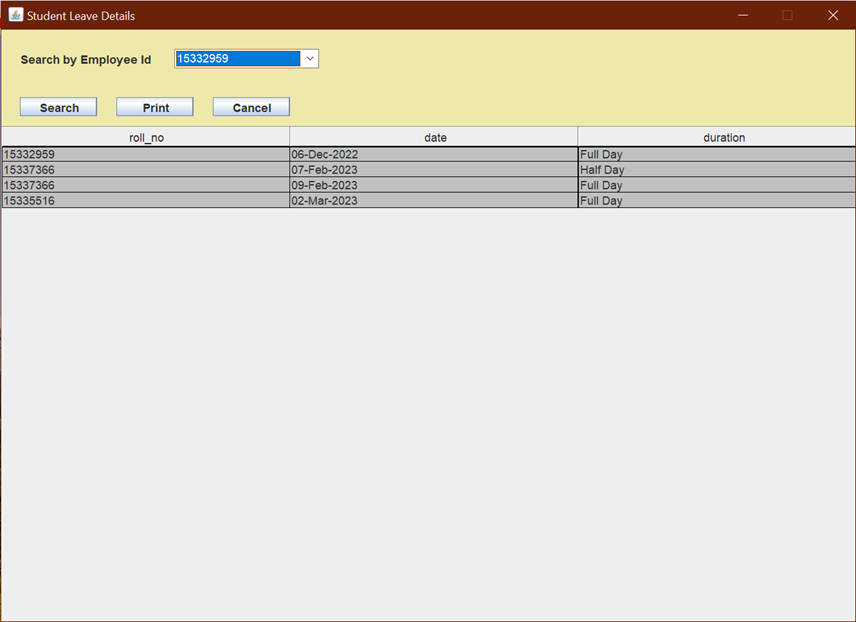

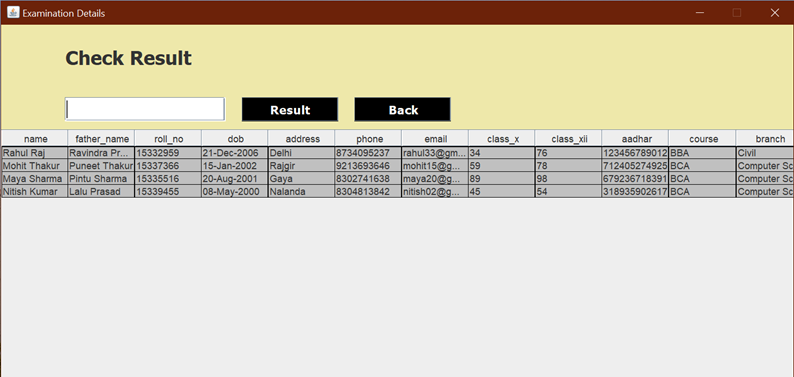

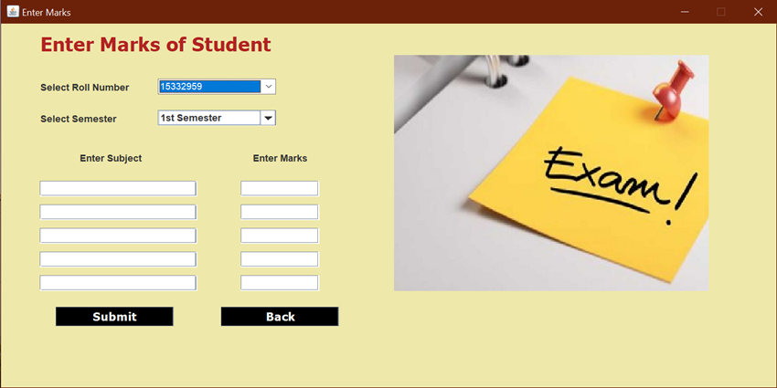

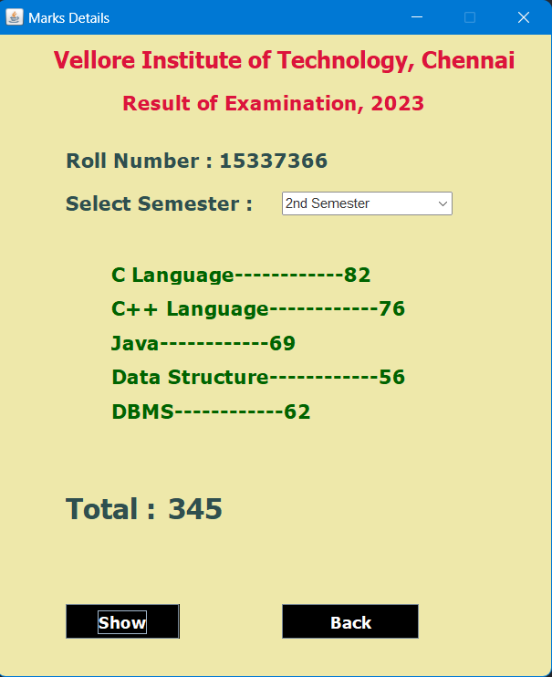

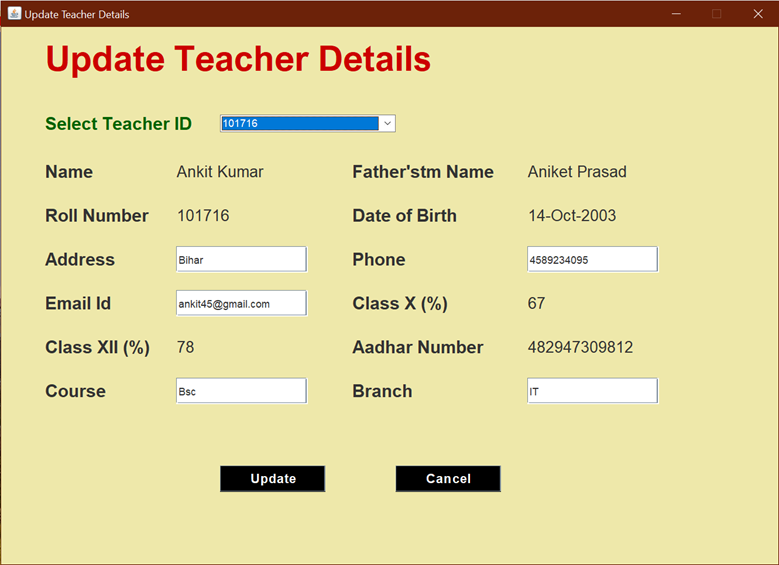

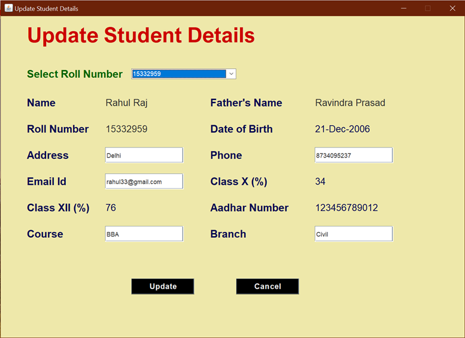

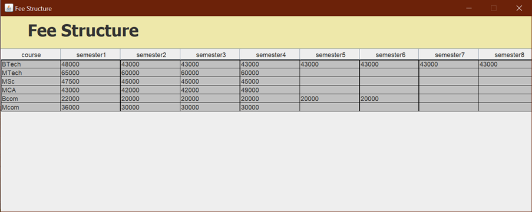
